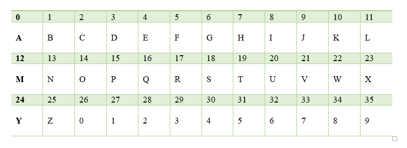
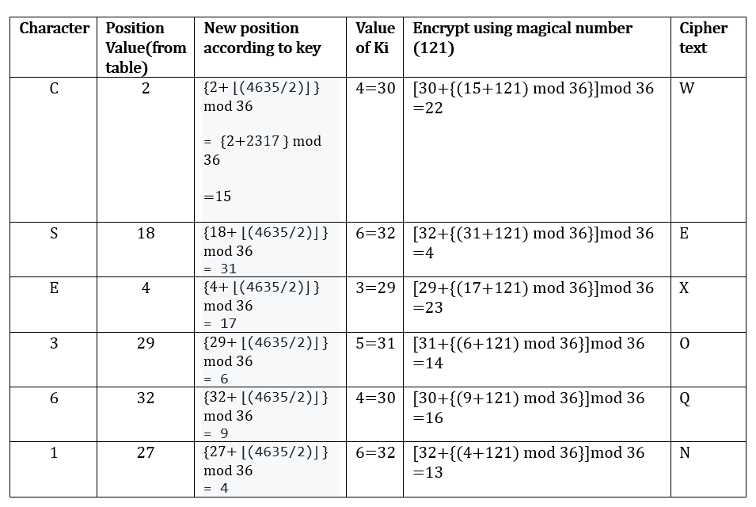
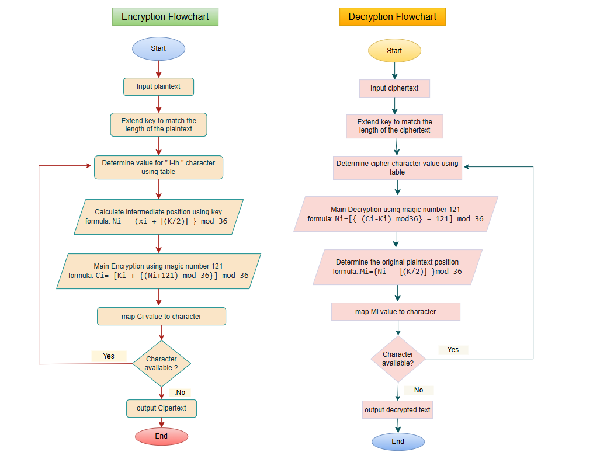

<p align="center">
  
</p>

<h2 align="center"><strong>Hajee Mohammad Danesh Science and Technology University</strong></h2>
<h3 align="center">Dinajpur-5200</h3>

---
<h1 align="center"><strong> SR-121</strong></h1>
<p align="center">A Symmetric Letter-Digit Cryptographic Algorithm</p>

---

### Course Information
- **Course Title:** Mathematical Analysis for Computer Science  
- **Course Code:** CSE 361  

---

### Submitted By

- **Name:** Sourav Roy  
- **Student ID:** 2102008  
- **Level:** 3  
- **Semester:** II  
- **Department:** Computer Science and Engineering

  ---

### 🧑‍🏫 Submitted To

 - **Name:** Pankaj Bhowmik  
 - **Designation:** Lecturer  
 - **Department:** Computer Science and Engineering

---

### 🧠 Algorithm Philosophy:
SR-121 is a custom-designed symmetric cryptographic algorithm developed to encrypt and decrypt messages composed of letters and digits. It is designed to securely handle variable-length inputs. A magic number -- 121 -- is used in both encryption and decryption and “SR” is an abbreviation of the designer’s name. That is why this algorithm is named SR-121.

---

## ✨ Core Functionalities:

- **Symmetric Encryption**  
  Uses the same transformation logic for both encryption and decryption, ensuring perfect reversibility without complex key exchanges.

- **Letter & Digit Support**  
  Fully supports alphanumeric characters, including uppercase/lowercase letters (`A–Z`, `a–z`) and numerical digits (`0–9`).

- **Flexible Input Size**  
  Capable of encrypting and decrypting strings of any length, from single characters to full sentences or codes.

- **Custom Logic**  
  Built on original algorithmic principles designed by the author, ideal for educational, experimental, and lightweight cryptographic applications.

---

---

## Position Table: 


---

## 🔐 Encryption Process:

The encryption process follows a position-aware and key-based mapping system. Here's a step-by-step breakdown:

### 📥 Steps for Encryption:

1. **Extend key:**  
   Repeat or truncate the key's digits to match the length of the plaintext. Let `Ki` be the digit at position *i* in the extended key.
   
2. **Determine position:**  
   Let `xi` be the position (0–35) of the *i-th* character from the plaintext, using the character-to-value table.

3. **Compute new position according to key:**  
   Calculate the transformed index using:
   
<br>

```text
   Ni = (xi + ⌊(K/2)⌋ } mod 36 
```
<br>
    
   where `K` is the key , ⌊(k/2)⌋ will give the floor value of the result after dividing the key by 2.
   
<br>

4. **Now Encrypt using the following formula:**  

```text   
Ci= [Ki + {(Ni+121) mod 36}] mod 36
```
<br>

where, `Ki` is the position value of the ` i-th `digit of the key. 


5. **Map to encrypted character:**  
   Use the value of `Ci` from  the position table.

---

## 🔓 Decryption Process

The decryption process reverses the encryption logic to accurately retrieve the original plaintext character using modular arithmetic and positional offsets.

### 📤 Steps for Decryption

1. **Extend key:**  
   Repeat or truncate the key's digits to match the length of the plaintext. Let `Ki` be the digit at position *i* in the extended key.
2. **Extract Cipher Position Value:**  
   Determine the numeric position `Ci` (0–35) of the *i-th* character in the ciphertext using the character-to-value table.

3. **Calculate Intermediate Position:**  
   Using the digit `Ki` from the repeated key at position *i*, compute:  
   

```text
Ni=[{ (Ci-Ki) mod36} – 121] mod 36
```
here, `Ni` is the `i-th` position of intermediate plaintext.

4. **Determine Original Plaintext Position:**  
   Compute the main position using:  
   
```text
Mi={Ni – ⌊(K/2)⌋ }mod 36
``` 

   Where `k` is the main key value and ⌊(K/2)⌋ gives the floor value of the result after dividing the key by 2.

5. **Retrieve Plaintext Character using position table:**  
   Use the value `Mi` to map back to the corresponding letter or digit using the character-value lookup table.

---

# Test case (Example):

```text
Plaintext= CSE 361
key= 4635
```

## Encryption: 

**Repeat key to match the length: 463546 , Ki is the i-th position of the repeated key.**



<br>

```text
Plaintext= CSE 361
Ciphertext=WEX OQN
```

---

## Decryption: 

**Repeat key to match the length: 463546 , Ki is the i-th position of the repeated key.**


<br>

```text
Plaintext = CSE 361
Ciphertext = WEX OQN
Decrypted text = CSE 361
```

---

# Flowchart: 


---

---

# Source Code (Python):

```text

charset = 'ABCDEFGHIJKLMNOPQRSTUVWXYZ0123456789'

def repeat_key(key, length):
    key_str = str(key)
    return (key_str * ((length // len(key_str)) + 1))[:length]

def encrypt(plaintext, key):
    plaintext = plaintext.replace(" ", "").upper()
    key_str = repeat_key(key, len(plaintext))
    k_floor = int(key) // 2
    ciphertext = []

    for i in range(len(plaintext)):
        x = charset.index(plaintext[i])                          
        n = (x + k_floor) % 36                                   

       
        ki=charset.index(key_str[i])
        shifted = (n + 121) % 36                                
        ci = (ki + shifted) % 36                                

        ciphertext.append(charset[ci])                         
    return ''.join(ciphertext)

def decrypt(ciphertext, key):
    key_str = repeat_key(key, len(ciphertext))
    k_floor = int(key) // 2
    plaintext = []

    for i in range(len(ciphertext)):
        ci = charset.index(ciphertext[i])                        

      
        ki=charset.index(key_str[i])
        shifted_n = (ci - ki) % 36                             
        n = (shifted_n - 121) % 36                           

        m = (n - k_floor) % 36                                  
        plaintext.append(charset[m])                            
    return ''.join(plaintext)


# test case
plaintext = "CSE 361"
key = 4635

encrypted = encrypt(plaintext, key)
decrypted = decrypt(encrypted, key)

print("Plaintext :", plaintext.replace(" ", ""))
print("Encrypted :", encrypted)
print("Decrypted :", decrypted)
```
